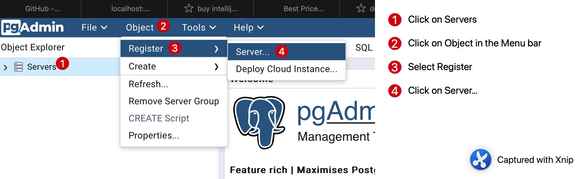
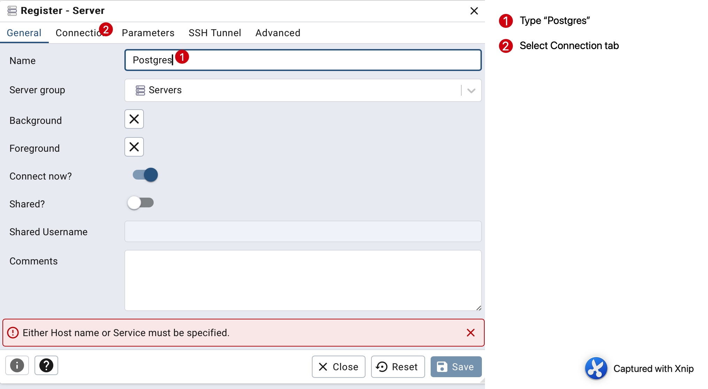
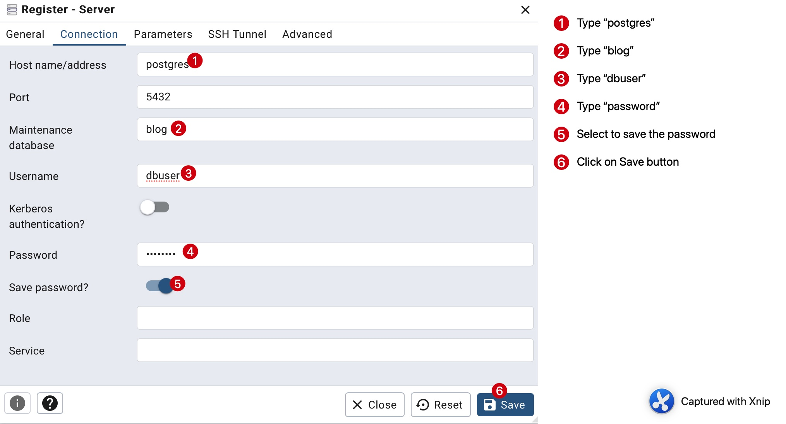

# Rumos' Blog Project

The Rumos' blog project is a backend application developed using Java, Spring Boot, and SQL. It is a Maven project that
uses PostgreSQL as its database, managed through Docker and pgAdmin.

The application provides two types of user roles: Admin and Common User. The credentials for these users are provided in
the README.md file. The application uses JWT for authentication, and the tokens have an expiration time that can be
configured.

The project includes SQL migration files that insert initial data into the database, including user and role
information. The SQL scripts are organized in a way that they create roles first, then users, and finally assign roles
to the users.

---

# User Application Credentials

### User Admin

- Email: admin@fake.com

- Password: password

### Common User

- Email: user@fake.com

- Password: Senha@00

---

# Swagger

The application's API can be explored and tested using Swagger, accessible
at http://localhost:8080/swagger-ui/index.html

---

# Postman Collection

A [Postman collection](postman_data.zip) is provided in the root directory of the project, which includes scripts to auto-generate access
tokens for each request based on environment variables.


---

# PostgreSQL Database

Use the [docker compose file](docker-compose.yml) to start the database container and the pdAdmin application.

Open a terminal from the project's root and run the following command:

```bash
docker-compose up
```

--- 

# pgAdmin

## Database management tool.

- URL: http://localhost:5050

- Username: email@fake.com

- Password: password

Configure the database connection using the following steps:


